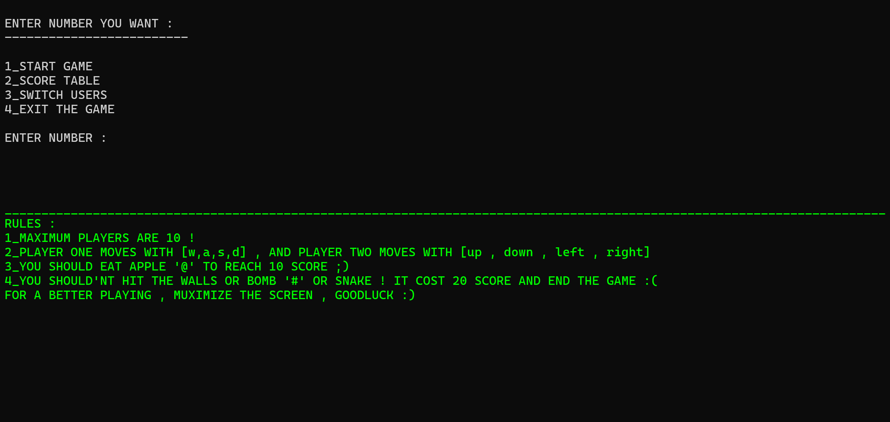
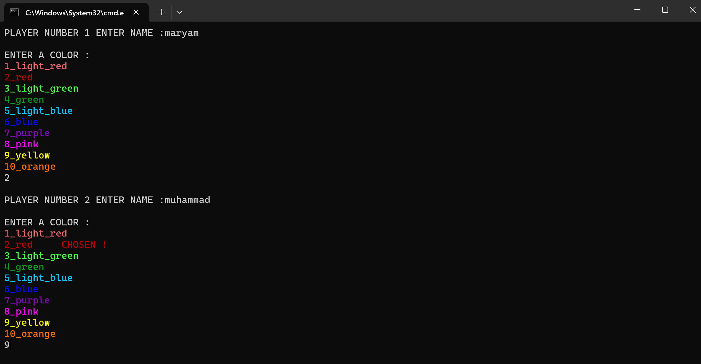
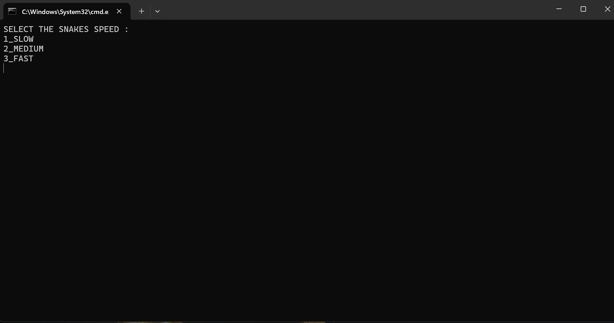
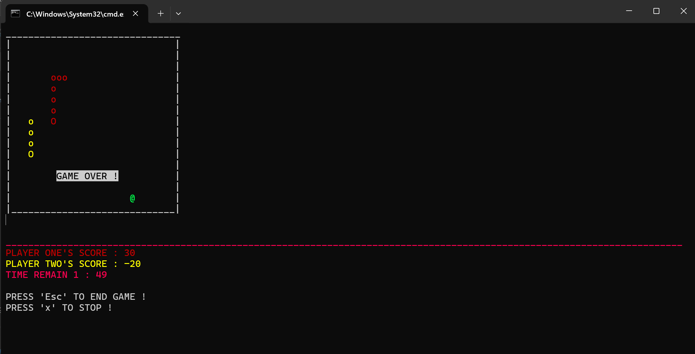
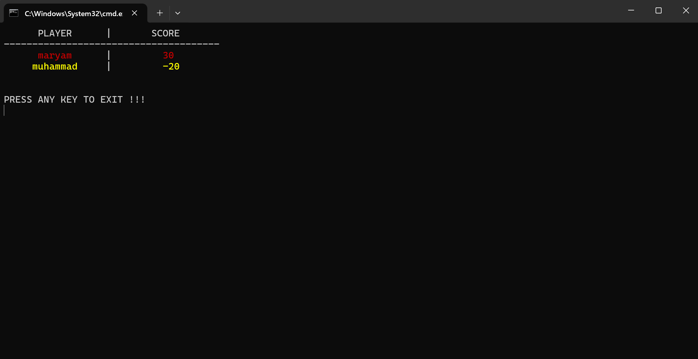

# SNAKE GAME 

Welcome to Snake Game!
This is a simple two-player game with fantastic graphics (in CMD). You can add more players and play in teams of two, and at the end, compare the scores!

# HOW TO PLAY 

- The game starts when one of the players moves.
- Your goal is to find and eat apples. Eating an apple increases your score, while eating a bomb decreases your score and ends the game!
- If you hit a wall or collide with the other player's snake, your score will be reduced and the game will end.

# HOW TO RUN

- **1**_ Download the project and place it in a folder.
- **2**_Ensure the required libraries are placed alongside the game files.
- **3**_Compile the game using g++ or any compatible compiler.
- **4**_Run the game in CMD (maximize the window for the best experience).
- **5**_Good luck!

# SCREEN SHOTS

- When you run the game you will face the menu first , you can type 1 to start a quick game .

- at first you need to make two players , so enter names and select colors !

- then you can set the speed !

- now get ready , game will starts when any player moves , try to get apple and avoid from eating the bomb !

- when any of players get bomb , or time ends , the game will end up .

- you can select table of scores from menu to see your scores

